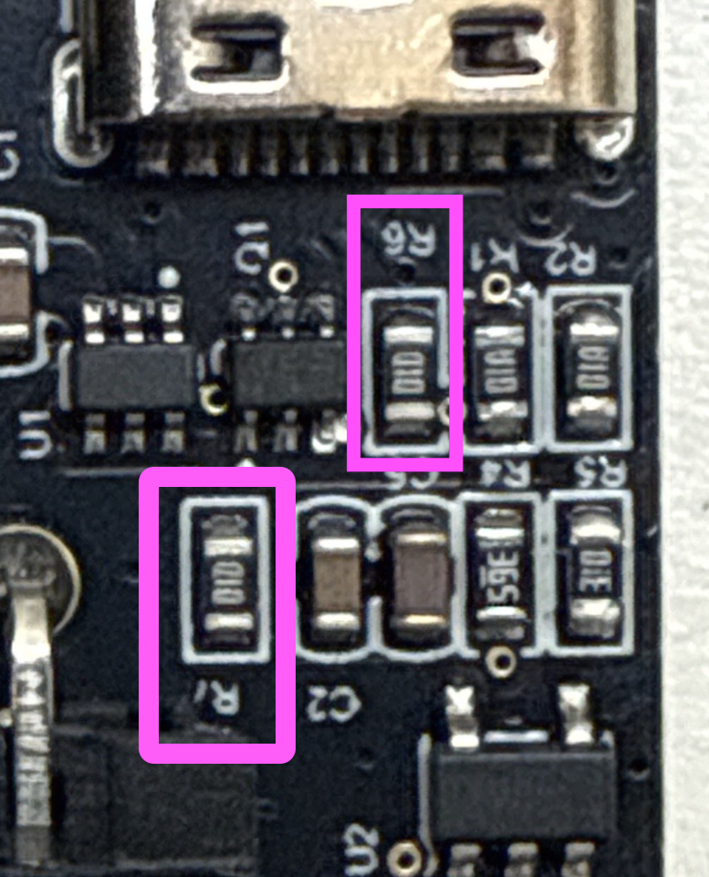

# Frequently Asked Questions

## Where is the latest BOM (Bill of Materials)?

The latest BOM can be [found on GitHub in the BOM folder](https://github.com/Positron3D/Prusawire/tree/main/BOM).

## How can I get a Serial # for my finished build?

We are accepting serials over on the [Positron 3D Discord](https://discord.com/invite/positron). Please submit your request to the `#prusawire-serial-request` channel over there.  There is an example submission and numerous other builds to reference for the format.

## Where can I get help with my build?

The community over on the [Positron 3D Discord](https://discord.com/invite/positron) is very helpful.  Check out the `#prusawire-questions` channel there.

## My NiteHawk-SB loses connection when there is a restart

If you are running V1.5 of the LDO Motors NiteHawh-SB USB board (the board that connects to the Raspberry Pi): you need to remove BOTH R6 and R7.

> the issue on NH-SB with a 1.5 USB board that looses communication after a "firmware restart" and needs a power cycle to turn back on is caused by the R7 and R6 resistor. They both need to be removed. There is a guide and video that shows how to remove the R7 here its the same for R6. If you are unable to or damage while trying reach out to your reseller where the kit was purchased and they will send you a replacement.
> @JoseFromLDO on the 

[PDF Instruction Guide](assets/NiteHawkSB_R6-R7_Resistor_Removal_Guide.pdf): this details for R7, but you will ALSO need to remove R6!

## How do I make the cool silver serial sticker once I have my serial#?

Instructions from @Telefaksi (PW.0004):
>Custom serial sticker for Prusawire. Made for 24 mm tape, I used Brother TZe-M951 Black/Matt Silver tape. Included are Affinity Designer 2 package folder as .zip, .stl and .step files for printable cutting stencil. QR-code is made with Affinity Designer's QR-code tool so url can be edited to link to your serial request post. I exported .png image and imported it to Brother's P-touch Editor for printing.  
>Fonts are included in the package but in case you want to download them the fonts are from Google fonts. Play in regular and bold. https://fonts.google.com/specimen/Play
>In images folder is WEEE marking as vector image.