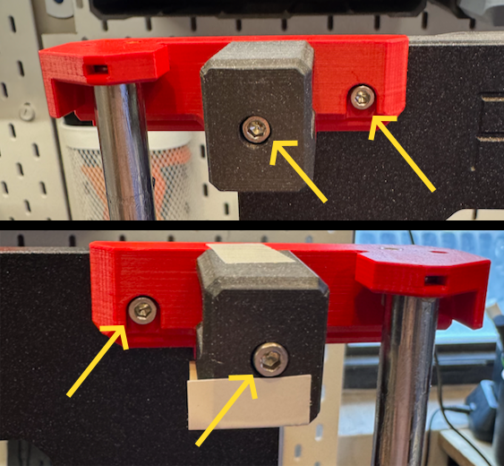
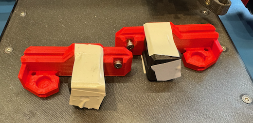
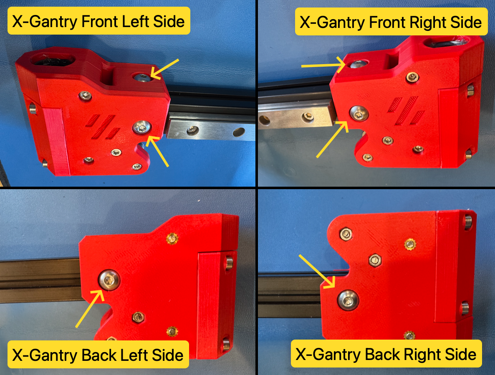
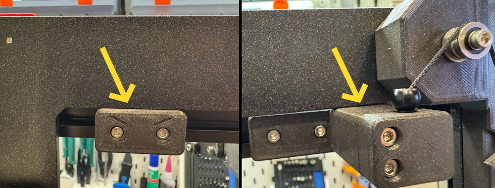
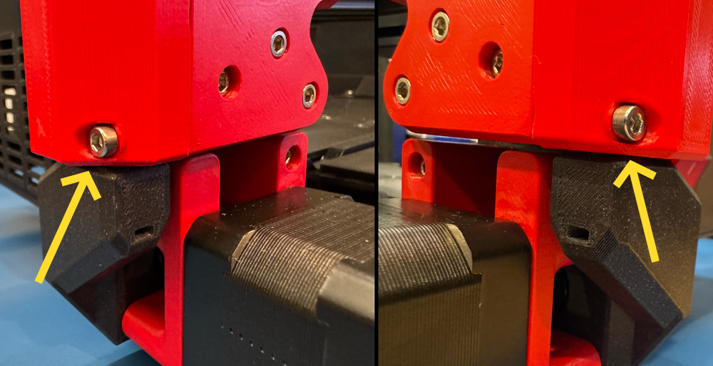

# Gantry Deracking
{: .no_toc}

  

    Table of contents
  

  {: .text-delta }
- TOC
{:toc}

**Current Compatibility:** *Prusawire - Beta 1*

## Overview
The gantry de-racking procedure is critical to ensure smooth motion in X and Z.  The general idea is to loosen certain screws on the gantry, bump the bottom of the gantry against the X and Z motor joints to align, and tighten the screws.

## Prerequisites
- Confirm your frame geometry is square: [Frame Assembly - Geometry Check](https://help.prusa3d.com/guide/2-frame-assembly_427481#427929)
- The following should be assembled already:
	- Frame
	- Z-Axis
	- X-Gantry with toolhead mount
- You should be ready to belt both the X and Z axis.

## Instructions
1. Remove the **toolhead** from the **carriage mount** (if currently installed).
	1. For Stealthburner, see the Stealthburner assembly manual for instructions.
2. Remove the **bed**, **y-carriage**, and **y-rods** completely off the printer (if currently installed).
3. Remove the **bumper block** and **door puller block** from the back of the gantry (if currently installed).

	

4. Remove the **top left idler assembly** and **top right idler assembly** loosening the M3 SHCS on each.  
	1. *TIP: A small piece of tape on the top and bottom of the assembly can be used to help keep the bearing stack together.*

	
	

5. Remove the **x-gantry assembly from the printer** by lifting it up off the z-axis rods.
6. Loosen all six **M5 BHCS** from each side of the x-gantry assembly.

	

7. Ensure each end of the 2020 extrusion is seated ALL the way into the printed parts.
8. Re-install the **x-gantry assembly** onto the printer by sliding it onto the z-axis rods from the top.
9. Move the **x-gantry assembly** up and down a few times to allow parts to settle.
10. Lower the **x-gantry assembly** until it bumps against the X and Z motor mounts.

	

11. Tighten the two top M5 BHCS on the x-gantry assembly, followed by the two front M5 BHCS.

	

12. Raise the **x-gantry assembly** up to the top just high enough to be able to tighten the rear two M5 BHCS.

	

13. Lower the **x-gantry assembly** back down to the bottom.
14. Re-install the **top left idler assembly** and **top right idler assembly** by tightening the two M3 SHCS on each.
15. Re-install the **bumper block** and **door puller block** on the rear of the gantry.
16. Move the gantry up and down.  You shouldn't feel any resistance.

	

	1. When the gantry bumps the top of the frame, it should bump equally on both sides.

	

	2. When the gantry bumps the bottom (X motor mount and Z motor mount), it should bump equally on both sides.

	

17. Check for any gantry racking a final time after installing XZ belts (and prior to installation of Y-axis).  Adjust front/top M5 screws if needed.