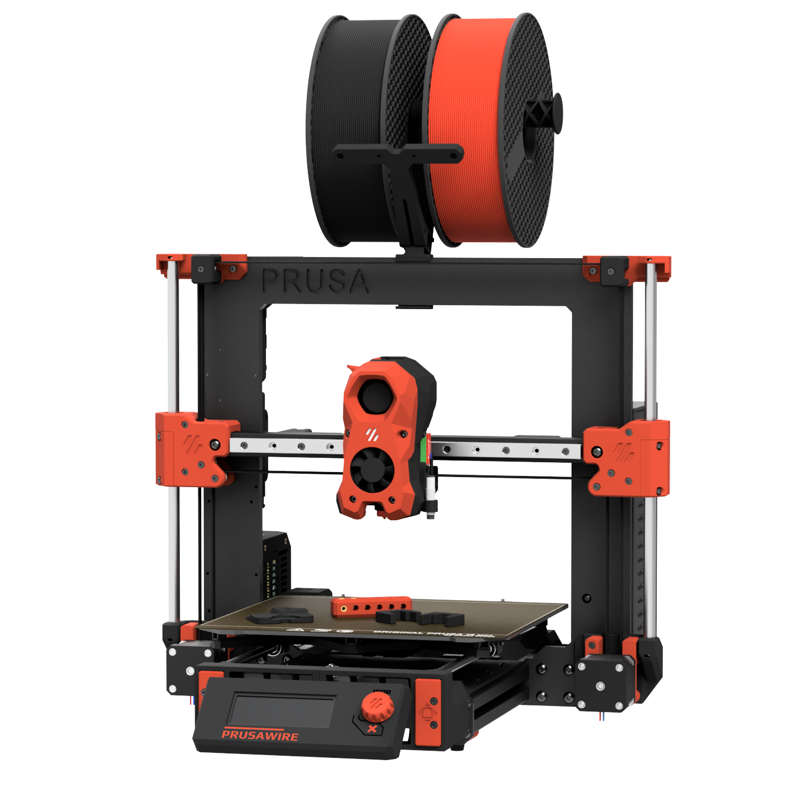

# Positron3D's Prusawire Documentation

A wholly unofficial Prusa MK3 and MK4 to Switchwire total conversion mod, from Positron's April Fools of 2025.

## About

> Nomad of Positron3D came up with this idea shortly after completing their Switchwire build. The idea started as a quick design exercise, to try and convert a Prusa MK4S frame into a Switchwire, using everything left over from a CORE One Upgrade.
>
> As the first iteration wrapped up, I took interest in the project, and decided to take this April Fools joke one step further and build it into a reliable machine.
>
> After months of hard work, please enjoy the build ❤
> 
> [-@ellafoxo](https://www.printables.com/@ellafoxo)

## Who This Printer is For

Pick one of the following:

 - You have an old MK3, MK3S, or MK3S+, and you want to teach an old dog new tricks and are on a budget
 - You upgraded from MK4S to a Core ONE, and have a leftover frame. You are okay spending money on building a new printer with that hardware.

Additionally, the following says this printer is for you: 

 - You want to take your first steps into RepRap beyond Prusa, and Voron is an exciting route.

## Technical Support

Prusawire, technically, does not count as a Voron Switchwire. We ask you kindly not to nag the Voron Design team for technical support.

Instead, please [join the Positron3D Discord](https://discord.com/invite/positron) for support with your build, and maybe share your progress over there too.

## Serial Numbers

We are accepting serials over on the [Positron 3D Discord](https://discord.com/invite/positron). Please submit your request to the #prusawire-serial-request channel over there. 
